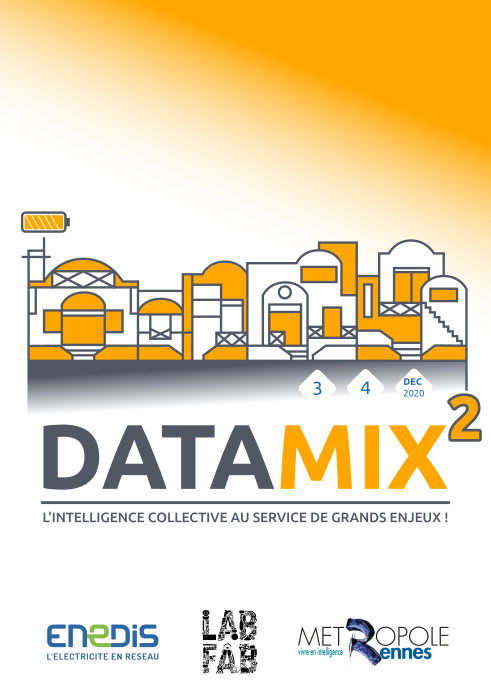

# DataMix2
DataMix² - Sobriété Numérique

Le LabFab étendu de Rennes Métropole et ENEDIS proposent cette année un évènement à distance, afin de coconstruire des solutions numériques sobres à partir de la donnée énergétique, dans la continuité du premier [DataMix organisé en 2019](http://www.wiki-rennes.fr/DataMix).

A partir du 27 Novembre, des ateliers de facilitation et de prototypage viseront à développer des solutions autour des idées proposées, afin d'aboutir, le 3 et 4 Décembre, à une présentation collective des prototypes créés :

* Fabrique ta TIC (utilisation des données Linky),
* Kit pédagogique pour l'entreprise,
* Représentation visuelle et artistique des données de consommation d'énergie,
* Badge de compétence "sobriété numérique".

Cet évènement, en ligne, est ouvert à tou.te.s, quelques soit votre âge ou votre connaissance !

Plus d'informations ici : http://www.labfab.fr/datamix²-sobriete-numerique

