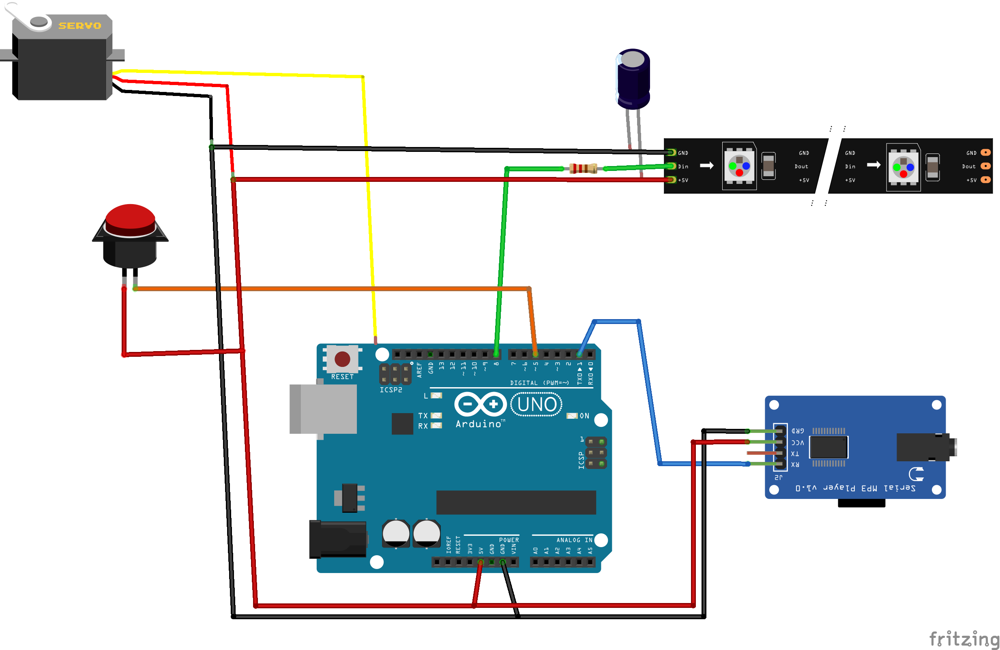

# Team3 - Représentation visuelle et artistique des données de consommation d'énergie

__Comment assembler le prototype de démo ?__

## Boîtier

_to do..._

## Électronique

### Liste des composants

* une carte à microcontrôleur Arduino UNO rev3 ;
* un servomoteur ;
* un ruban de LEDs multicolores (NeoPixel) ;
* un condensateur 1000 µF
* une résistance 470 Ω
* une carte lecteur MP3 ;
* une petite enceinte ;
* une carte micro SD ;
* une alimentation 5V / 2A ;
* une platine d'expérimentation (breadboard) ;
* un bouton (pour la démo !) ;
* quelques fils de prototypage et quelques composants ...

### Connexions

| Arduino UNO rev3 | MP3 player | RGB LED strip | servomotor | Button |
|:---:|:---:|:---:|:---:|:---:|
| 0 (RX) | - | - | - | - |
| 1 (TX) | RX | - | - | - |
| 2 | - | - | - | - |
| 3 | - | - | - | - |
| 4 | - | - | - | - |
| 5 | - | - | - | X |
| 6 | - | - | - | - |
| 7 | - | - | - | - |
| 8 | - | DATA | - | - |
| 9 | - | - | DATA | - |
| 10 | - | - | - | - |
| 11 | - | - | - | - |
| 12 | - | - | - | - |
| 13 | - | - | - | - |
| A0 | - | - | - | - |
| A1 | - | - | - | - |
| A2 | - | - | - | - |
| A3 | - | - | - | - |
| A4 | - | - | - | - |
| A5 | - | - | - | - |
| +5V | +5V | +5V | +5V | X |
| GND | GND | GND | GND | - |



### Code Arduino

#### Librairies nécessaires :
* `Adafruit NeoPixel 1.7.0`

### Préparation des fichiers sur la carte micro SD
Sur la carte micro SD, l'ensemble des fichers *MP3* doivent être placés dans un dossier nommé **01**.
Le nommage de ces fichiers répond à un formalisme assez strict :

 * un préfixe **001_**, **002_**, etc. ;
 * pas de caractères spéciaux (pas d'accents, guillemets, etc.) ;
 * pas d'espaces (les remplacer par des tirets bas par exemple).

Exemple de de contenu :
```
01/
├── 001_son_1.mp3
├── 002_son_2.mp3
├── 003_son_3.mp3
```
